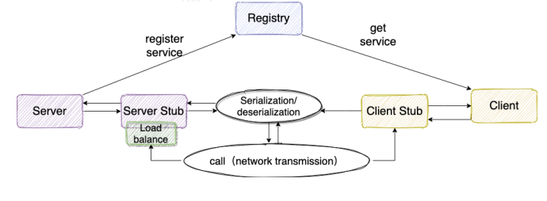

# ASimpleRpcFramework
[](LICENSE)

一套简易RPC框架，技术栈用到了Netty（用于网络传输，也实现了原生Socket版本）、Kryo（序列化）和Nacos（注册中心）。

## 基本架构


### 什么是RPC？

>RPC(Remote Procedure Call) 即远程调用，通过名字我们就能看出RPC关注的是远程调用而非本地调用。

### 为什么要用RPC?

>因为两个服务器上的方法并不在同一个内存空间，所以需要网络编程的方法才能调用。

### RPC能做什么？
>假设A、B两个服务部署在两个不同的机器上，如果A想调用服务B就可以使用RPC。简单来说，RPC的出现就是为了使调用远程方法像调用本地方法一样简单！

## 特点

- 实现了基于 Java 原生 Socket 传输与 Netty 传输两种网络传输方式
- 使用Kryo作为序列化方式 
- 实现了两种负载均衡算法
- 使用 Nacos 作为注册中心，管理服务提供者信息

## 运行

### 开启Nacos注册中心（单机模式）
``sh startup.sh -m standalone``

### 自定义接口

```java
package com.kyriez;

public interface HelloService {
    String hello(HelloObject hello);
}
```

### 服务端自定义实现类

```java
package com.kyriez;

import org.slf4j.Logger;
import org.slf4j.LoggerFactory;

public class HelloServiceImpl implements HelloService{
    private Logger logger = LoggerFactory.getLogger(HelloServiceImpl.class);
    @Override
    public String hello(HelloObject hello) {
        logger.info("Received the hello object " + hello.getId());
        return "Hello " + hello.getMessage();
    }
}
```

### 开启服务提供者

运行
```java
package com.kyriez;

import com.kyriez.Registry.DefaultServiceProvider;
import com.kyriez.provider.ServiceProvider;
import com.kyriez.Server.Netty.NettyServer;

public class NettyServerTest {
    public static void main(String[] args) {
        HelloService service = new HelloServiceImpl();
        NettyServer server = new NettyServer("127.0.0.1", 9999);
        server.publishService(service, HelloService.class);
        server.start();
    }
}
```

### 客户端调用服务

运行
```java
import com.kyriez.Client.Netty.NettyClient;
import com.kyriez.Client.RpcClientProxy;
import com.kyriez.HelloObject;
import com.kyriez.HelloService;

public class NettyClientTest {
    public static void main(String[] args) {
        NettyClient client = new NettyClient();
        RpcClientProxy proxy = new RpcClientProxy(client);
        HelloService service = proxy.getProxy(HelloService.class);
        HelloObject obj = new HelloObject(12, "KYRIEZ");
        String res = service.hello(obj);
        System.out.println(res);
    }
}
```

先运行服务端 在运行客户端 会输出 `Hello KYRIEZ`

## TODO

- 多种序列化实现
- 自定义更合理的通信协议
- 降低耦合度
- 提供其他负载均衡算法
- 优化Channel的使用

## LICENSE

My-RPC-Framework is under the MIT license. See the [LICENSE](https://github.com/KYRIEZX/ASimpleRpcFramework/main/LICENSE) file for details.

